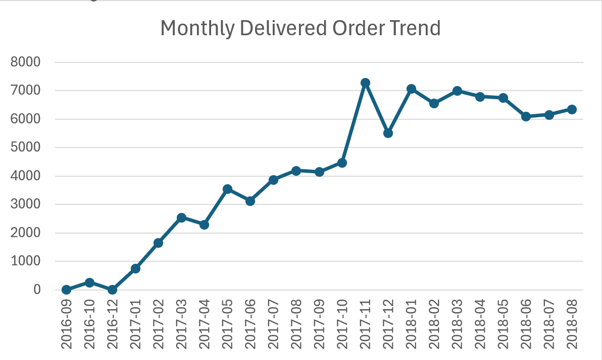
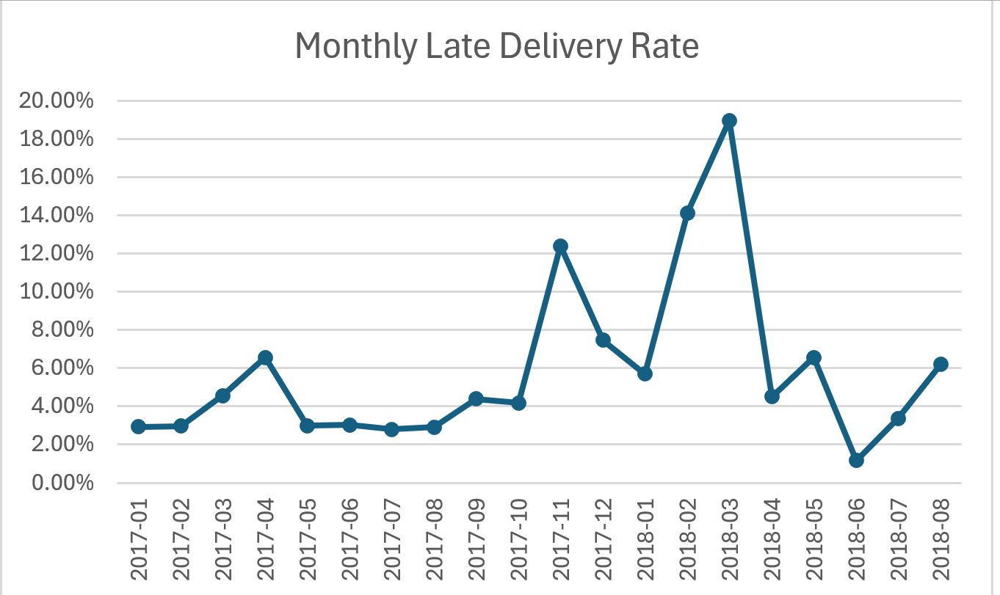
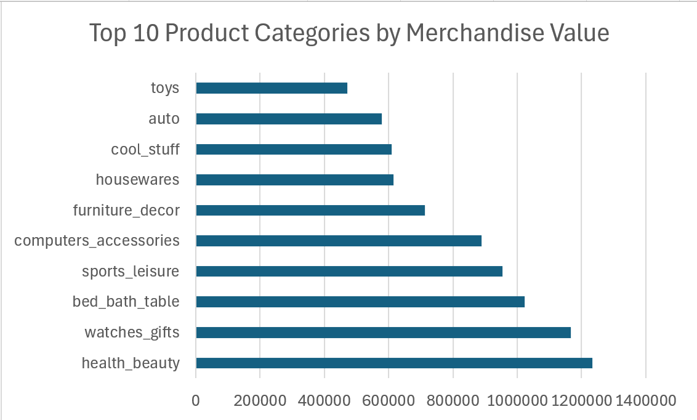

# Customer & Commercial Intelligence Platform

An end-to-end analytics project using the Olist Brazilian E-Commerce dataset to analyse customer behaviour and commercial performance across orders, payments, deliveries, products, sellers, reviews, and geography.

The project is designed to mirror an end-to-end analytics workflow — from data understanding and quality assessment through data integration, business analysis, SQL, data modelling, dashboard development, and business recommendations.

**Status: In Progress** — Data understanding, profiling, cleaning, integration, and Excel analysis are complete. SQL analysis and Power BI development are next.

## Planned Project Pipeline

Raw Data → Data Understanding & Profiling → Python Cleaning → Data Integration → Excel Analysis → SQL Server → SQL Analysis → Power BI Data Model → DAX → Dashboard → Business Recommendations

## Progress So Far

### Data Understanding

Explored all Olist tables and mapped how customers, orders, order items, products, payments, reviews, sellers, geolocation, and product-category data connect.

A key modelling distinction identified was:

- `customer_id` — order-linked customer identifier
- `customer_unique_id` — identifier representing the same customer across multiple orders

Understanding this distinction is important for accurate customer-level analysis.

### Data Documentation

Created column-level documentation covering field meaning, datatype, expected analytical use, and potential data-quality issues across the source tables.

### Data Profiling

Investigated:

- Missing values and duplicate records
- Order-status distribution
- Customer ordering behaviour
- Late deliveries and delivery-delay severity
- Unusual delivery dates
- Payment anomalies
- Review patterns
- Product-data quality issues
- Seller and customer geolocation coverage

### Data Cleaning

Performed data cleaning and validation using Python and pandas, including:

- Correcting datatypes
- Standardising postcode fields
- Removing duplicate geolocation records
- Handling missing product categories
- Creating data-quality flags
- Calculating delivery delay (`days_late`)
- Validating primary-key uniqueness and table relationships

A cleaning log was maintained to document identified issues, actions taken, and reasoning.

### Data Integration

Built an integrated analytical dataset by connecting:

Customers → Orders → Order Items → Products → Sellers → Geography

Payments and reviews were aggregated to order level before integration to avoid many-to-many row duplication.

Two analytical datasets were produced:

- `orders_integrated` — item-level dataset for product, seller, and merchandise analysis
- `order_summary` — order-level dataset for customer, payment, review, and delivery analysis

### Excel Business Analysis

Imported integrated data into Excel using Power Query and used PivotTables and charts to investigate business performance.

Analysis completed includes:

- Monthly order trends
- Geographic order performance by state and city
- Late-delivery rates
- Delivery-delay severity
- Delivery performance versus review scores
- Installment behaviour versus order value
- Monthly commercial trends
- Product-category merchandise value
- Product and seller-level analysis

A dedicated Excel chart sheet was created to summarise selected findings.

## Excel Analysis Preview

### Monthly Delivered Order Trend

### Monthly Late Delivery Rate

### Top Product Categories by Merchandise Value

## Project Files

- [Data Profiling Notebook](01_data_profiling.ipynb)
- [Data Cleaning Notebook](02_data_cleaning.ipynb)
- [Data Integration Notebook](03_data_integration.ipynb)
- [Data Profiling Summary](Data_Profiling_Summary.pdf)
- [Data Understanding & Column Documentation](data_understanding.xlsx)
- [Cleaning Log](cleaning_log.csv)

> The full Excel analysis workbook is maintained locally due to GitHub file-size limitations. Selected analysis outputs are included above as screenshots.

## Coming Next

- SQL Server analytical queries
- Customer segmentation and repeat-customer analysis
- Sales and commercial trend analysis in SQL
- Power BI star-schema data model
- DAX measures and KPIs
- Interactive Customer Intelligence and Commercial Performance dashboard
- Final business recommendations

## Tools & Skills Used So Far

- **Python / pandas** — profiling, cleaning, validation, and data integration
- **Excel** — Power Query, PivotTables, PivotCharts, and business analysis
- **Data Modelling** — table relationships, analytical grain, aggregation strategy
- **Data Quality** — anomaly detection, validation flags, and cleaning documentation
- **Multi-table Integration** — one-to-many joins and prevention of many-to-many duplication
- **Business Analysis** — customer, delivery, payment, geographic, and product performance analysis

## Dataset

[Brazilian E-Commerce Public Dataset by Olist](https://www.kaggle.com/datasets/olistbr/brazilian-ecommerce)

The dataset contains approximately 100,000 orders from 2016–2018 across customer, order, product, payment, review, seller, and geographic data.
